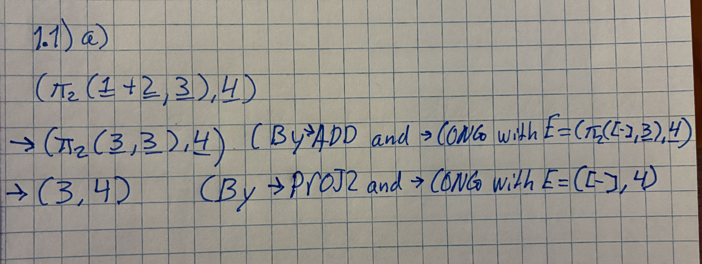
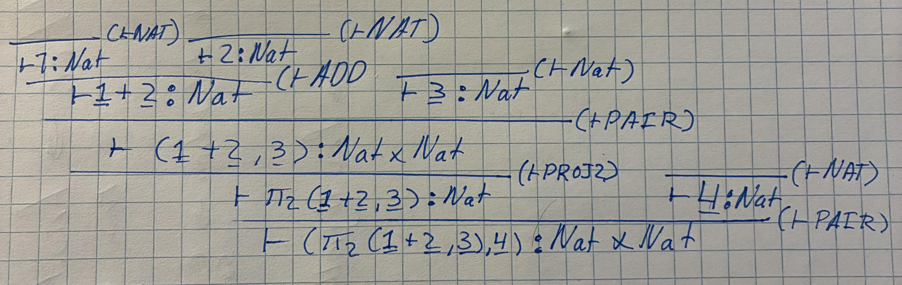
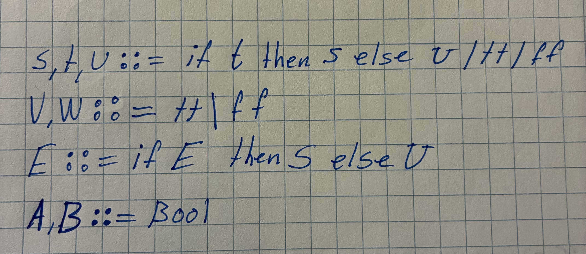
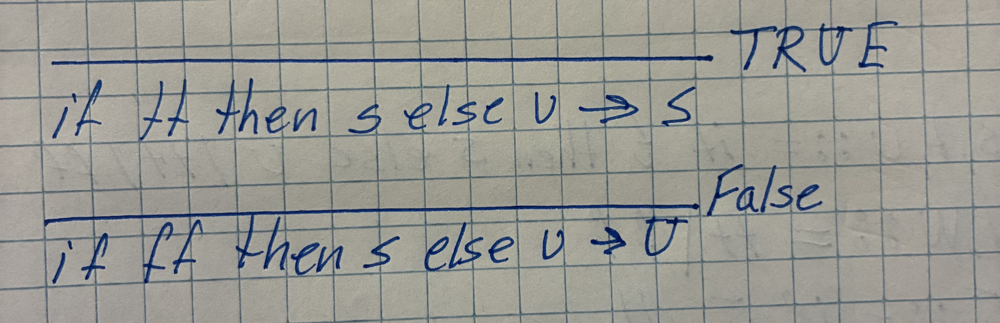
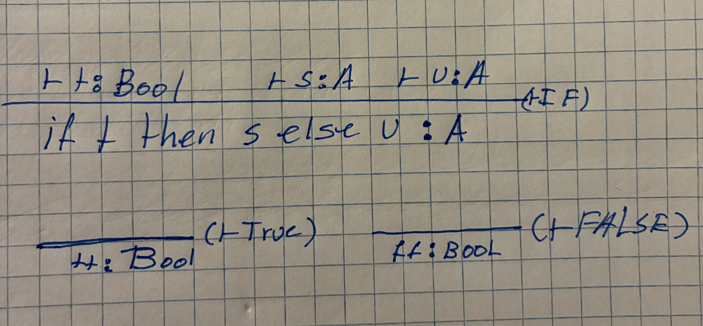
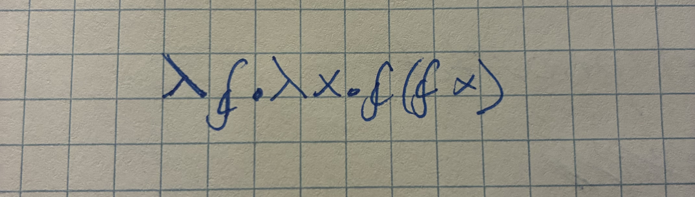
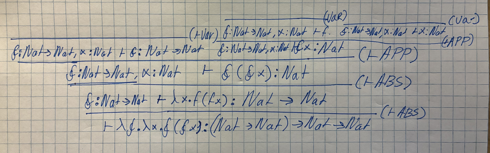
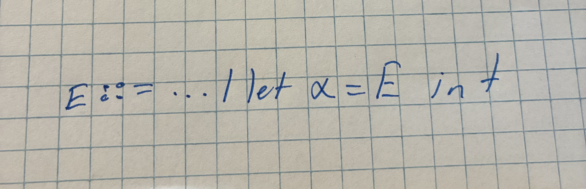
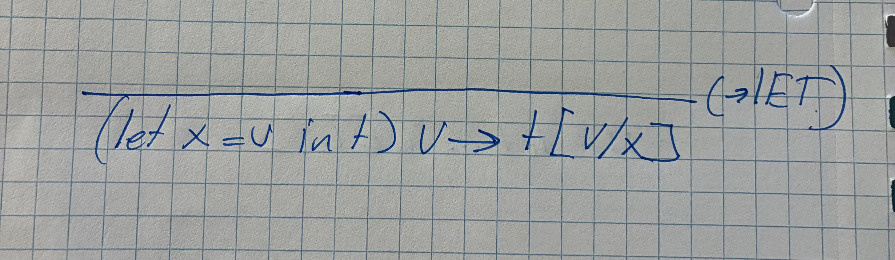

---
header-includes:
  - \usepackage{float}
  - \floatplacement{figure}{H}
---

# 1.1

## a)

# 1.2

## a)

 

# 1.3)

We extend the arithmetic language defined in figure 2 such that it can express boolean values and If-then-else statements.

## a,b)

The following are extensions terms, values, types and evaluation context for the grammer already defined in Figure 2 (Sorry, i by accident wrote it so close that i might aswell just squich the tasks together)

## c)

Here are the two boolean rewrite rules we extend the arithmetic language's small step operational semantics with: 

## d)

Here are the extensions to the typing rules:

# 1.5

# 2.1

## a)

## b)

Observe the type derivation for (nat -> nat) -> nat -> nat

# 2.3

## a)

## b)

