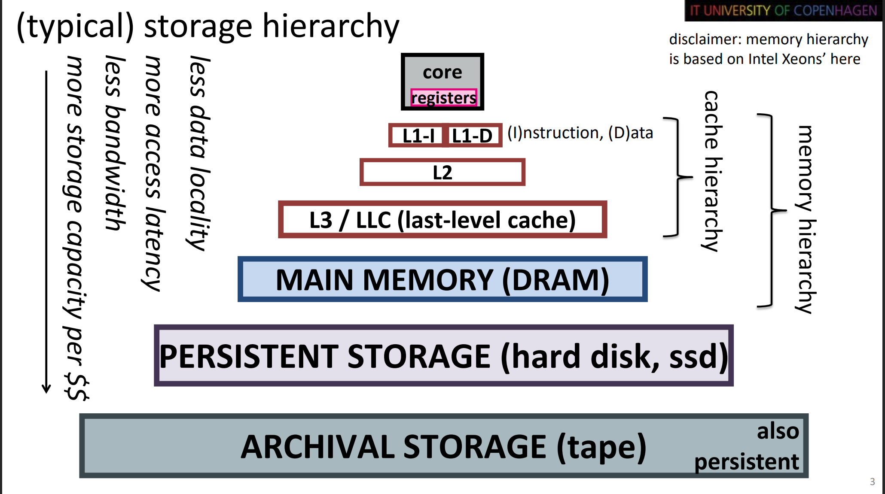
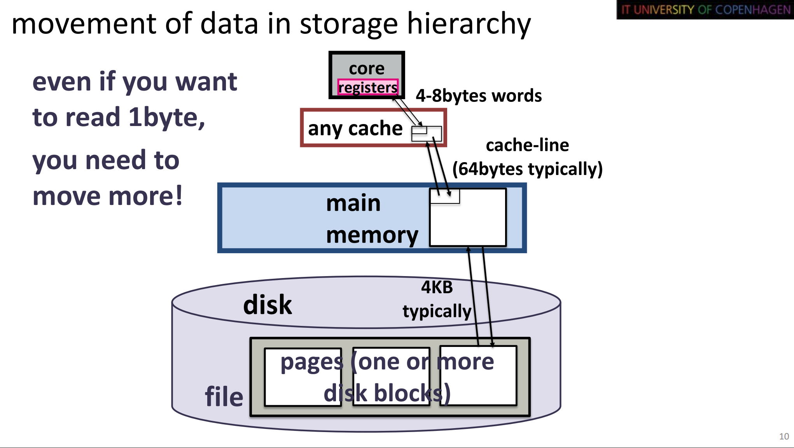
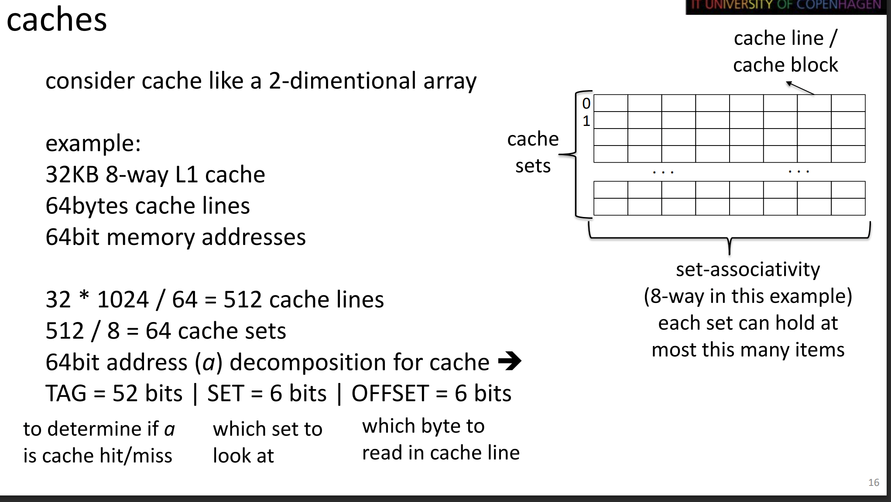
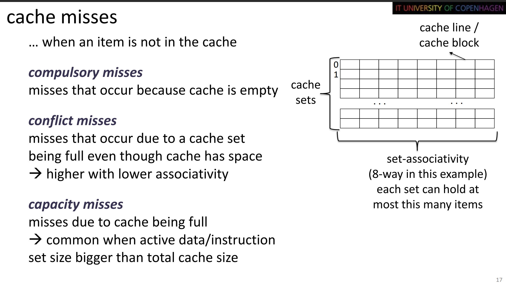
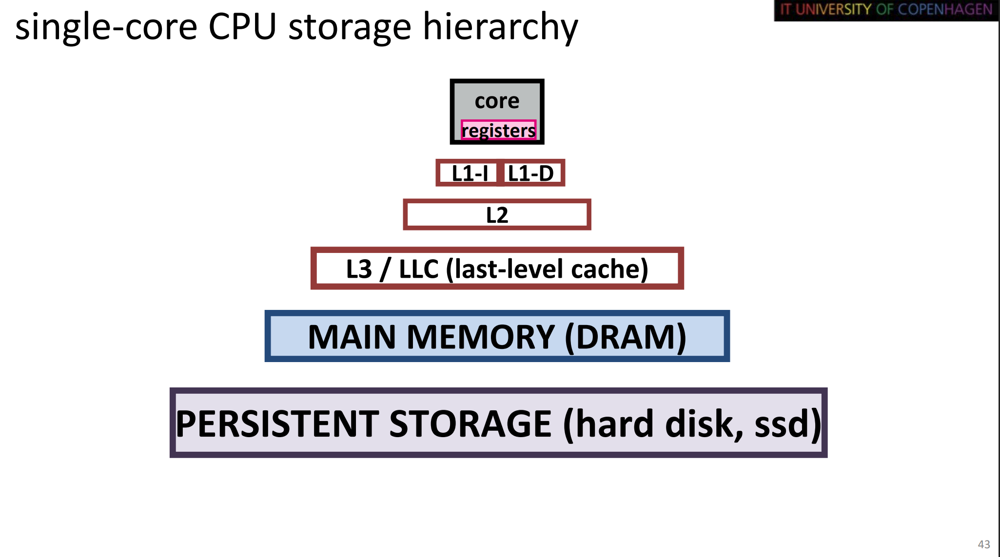

# Lecture 2 notes

## Storage hierarchy

## Fetching data

## Core affinity

The process of binding a process to a core or a thread.

## Localities 

Discribes how data and code are ordered in space and time (Basically, how easy is it to get a hold of a piece of data from where you are)

- Temporal locality: Frequently used items are likely to be used again.
- Spatial locality: Items are closely together in space.

    __Code also has a locality__!

## Caching

Higher level cache layers are inclusive. They save data from the lower levels also (L1, L2, L3).

Not guaranteed for software or higher-level caches.

### Types of cache misses
There exists three different types of cache misses

- Compulsory: The cache is empty
- Conflict: Cache set is full, but the cache still has space
- Capacity: The cache is full

## Hardware parallelism

Minimize stall time ram/cache waiting time. Stalls begin to incour at the L3 layer.

CPU layers

- Frontend: Fetches and decodes instructions from the cache
- Backend: Where the Arithmetic units, load and store components are located.

Stalls
- fetching, decoding: Cause frontend stall
- Rest: Backend stalls.

### Instruction pipeline

Instruction pipline allows multiple instructions to execute in parallel, by allowing one instruction to execute one stage, if the next instruction has already been through this stage. 

A 4 way superscaler CPU can process 4 pipelines in parallel.

### Out of order execution

Instructions can be reordered by the processor based on what input data is available. An instruction can be reordered, as long as the result of the reordering does not change the result of the operation.

### SIMD (Single instruction multiple data)

A single instruction that can process multiple pieces of data a at the same time. An example is multiplying 8 different integers with 8 integers.

### Simultaneous Multithreading (SMT) (HyperThreading)

A CPU that supports multiple threads per core. Each thread has distinct states, that are kept in larger CPU registers. This allows multithreading without the overhead of frequent context switches.

