# Lecture 3

## Architectural Synthesis

Finding architectural solutions to architecturally significant requirements.
Finding the right architectural patterns to solve the issues we have described.
Developing the propesed architecture.

System qualities are often conflicting. We need to strike a balance between them

    Example: Performance vs. modifiability
    Example: Security vs cost

## Process

- Number of requirements
- Chose architectural style
- What functionality is needed
- How do you divide the work going into satifying the functionality

## Architectural patterns

Defines types of elements and relationships that work together to solve a problem.

Architectural pattern = architecural style.

Pattern -> The generic way in which we solve a problem. 
View -> The concrete way in which the pattern has been applied to solve the problem in the given system.

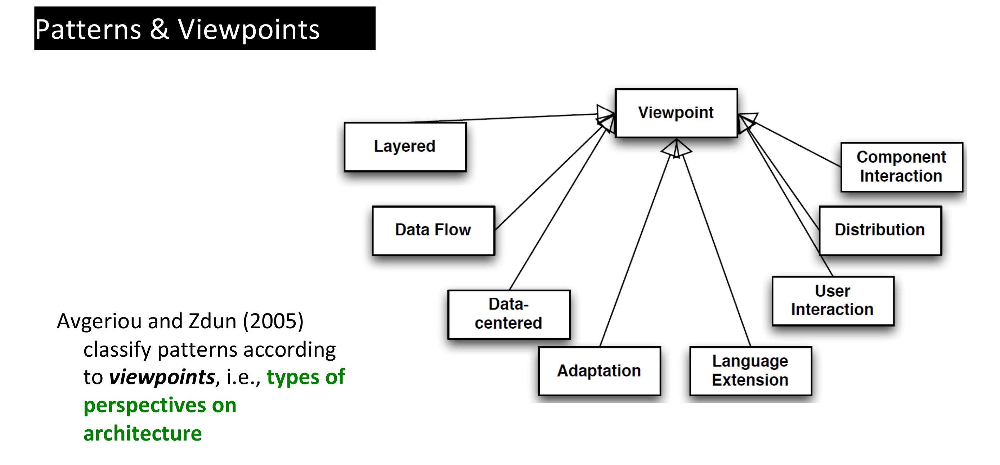

Patterns are not applied to solve singular qualities -> They affect multiple patterns with gains and tradeoffs.

## Architectural tactics

Directly affect and relate to a quality attribute

- Captures what architectures do in practice
- May influence more than one attribute

A collection of architectural tactics -> architectural strategy.

Architectural tactics are concrete software concepts, that can be used to address the attribute

- Ping/echo
- Heartbeat
- Retry
- Transaction
- Authorization
- Authentication

### Examples

#### Client-server

Clients communicate with a server.

### Publish/Subscribe

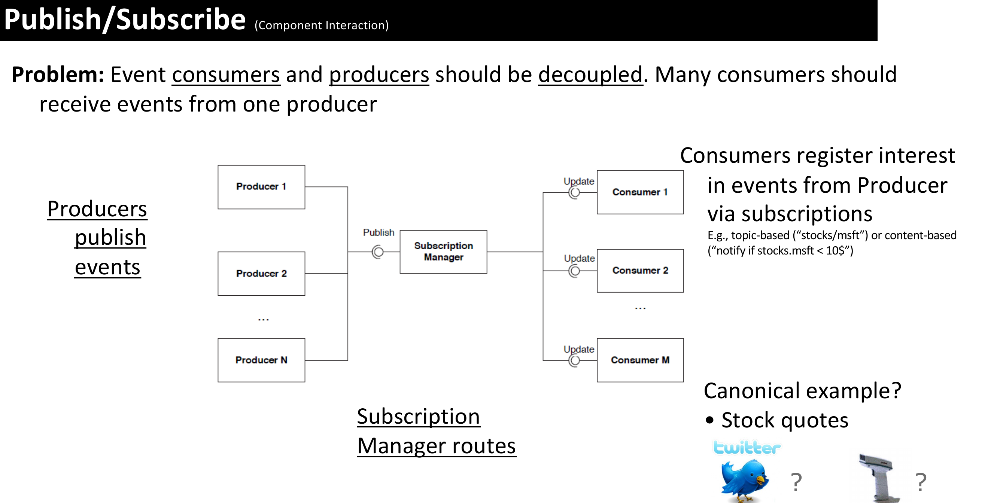

### Peer-to-Peer

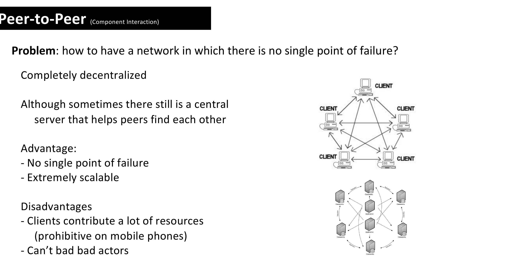

### Microkernal

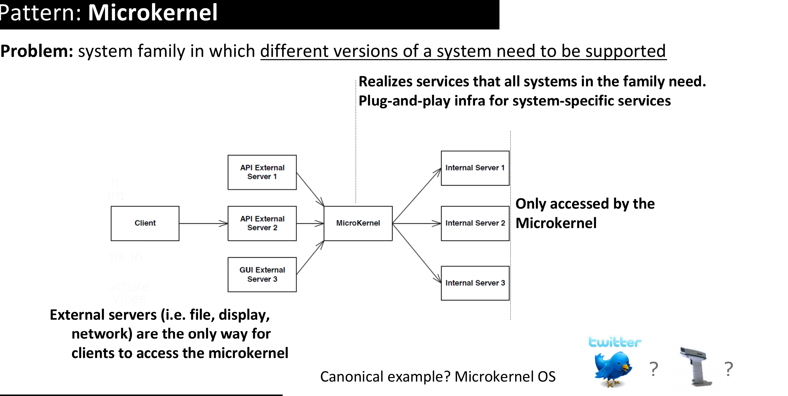

### Plugin architecture

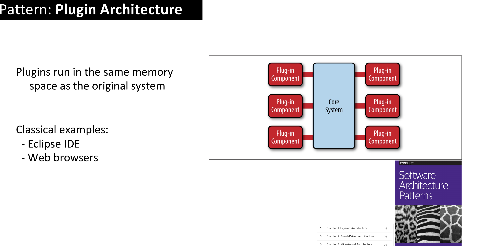

### Pipes and filters

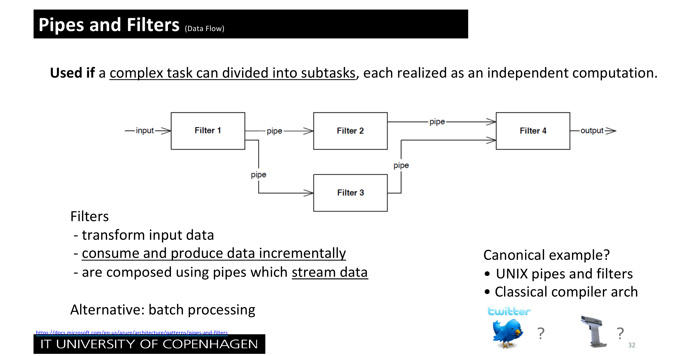

### Message queue

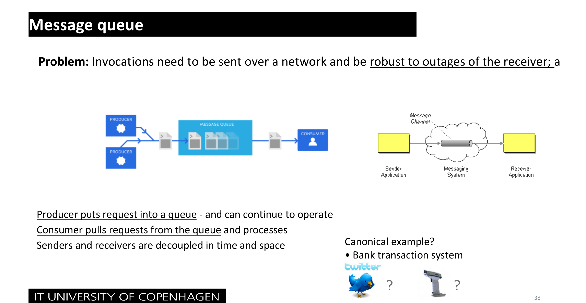

### Event broker

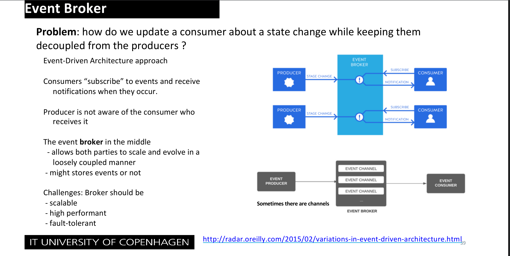

### Microservices

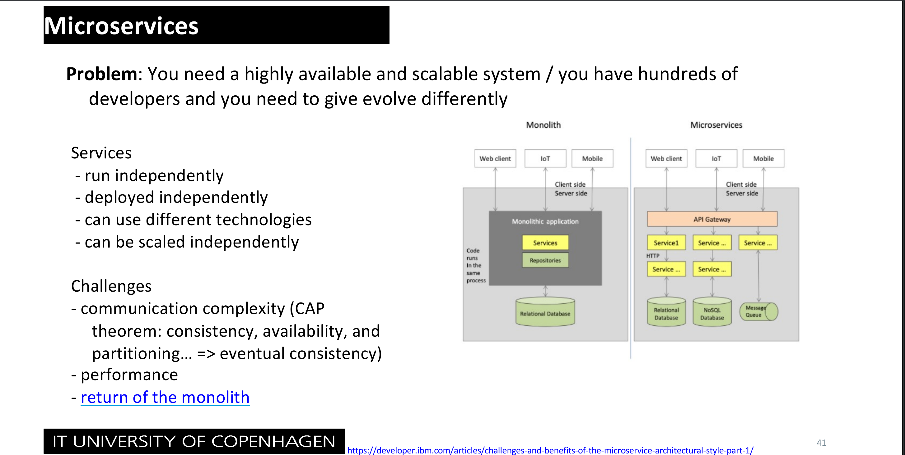

### Monolith

### Repository

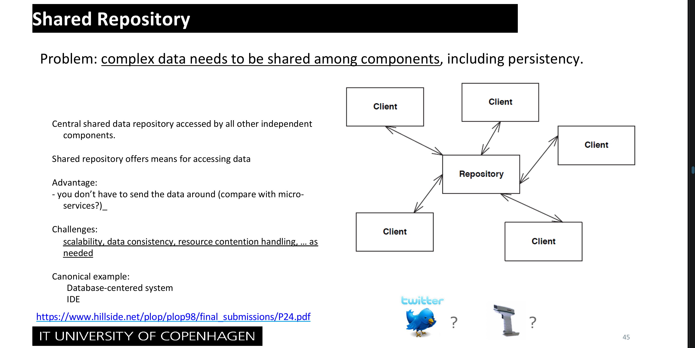

### Layered architecture

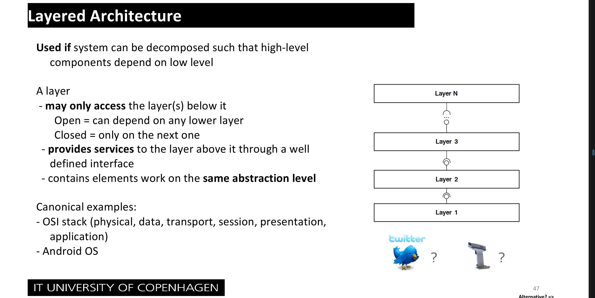

### MVC (Model View Controller)

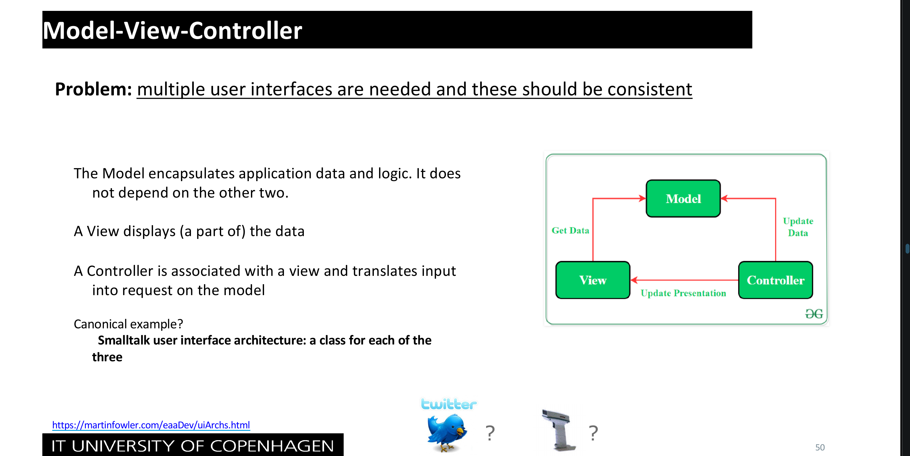
